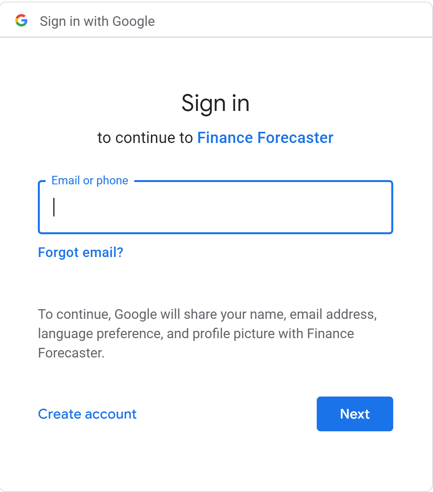
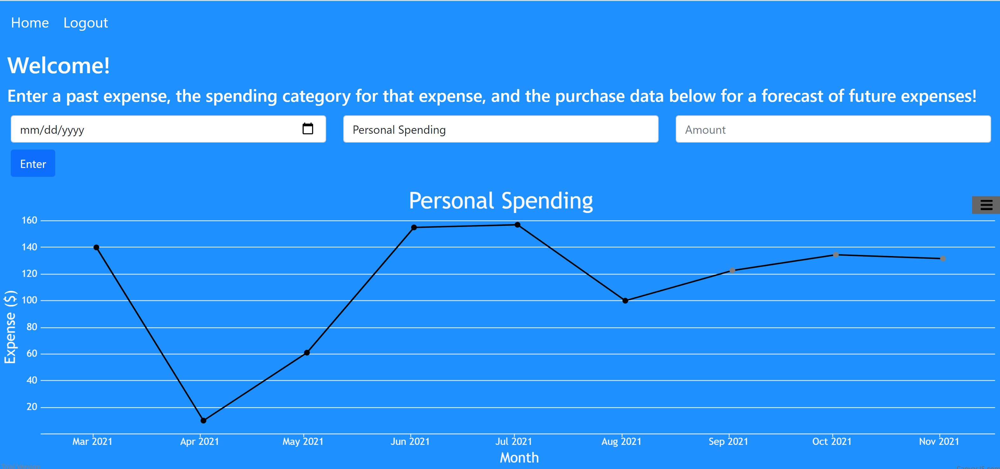

# Finance Forecaster
Finance Forecaster is a web application that allows users to input their past expenditures and view future predictions of their spending habits, making budget planning a more efficient process. 

## Prerequisites
Before you begin, ensure you have met the following requirements:
* Python
* Flask
* Numpy
* TensorFlow
* Keras
* Sklearn
* NodeJS 
* npm 
* MongoDB

## Installation
1) Clone the repo
```bash
git clone https://github.com/anushasaha16/finance-forecaster.git
```
2) Install NPM Packages
```bash
npm i
cd server
npm i
cd ../client
npm i
```

## Run

### ML Model API
```bash
cd api
python api.py
```

### Server
```bash
cd server
nodemon index.js
```

### Client
```bash
cd client
npm start
```
Open http://localhost:3000 to view it in the browser.

## Usage

Users must sign in using their Google accounts.
Upon logging in, users can input new expenses and have access to a visualization of their past monthly expenditures and a forecast of their monthly expenditures for the next 3 months.

They can specifically choose which spending category they're inputing an expense for and which spending category they're viewing a visualization for.

## Built With
* Python
* TensorFlow
* Flask
* JavaScript
* Node.js
* Express
* React.js
* MongoDB
